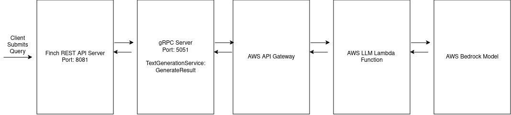
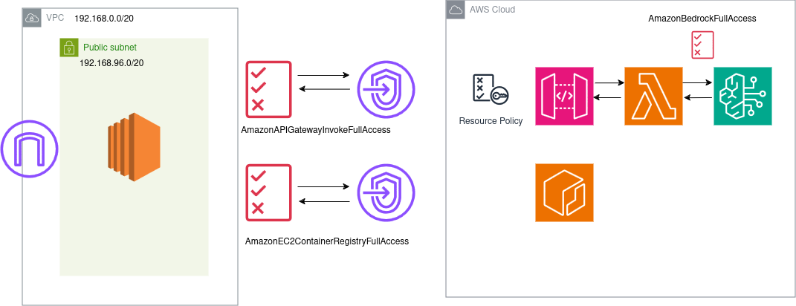

# Homework #3

# Student Information
- First Name: Mohammad Shayan Khan
- Last Name: Khan
- UIN: 667707825
- UIC Email: mkhan405@uic.edu

# Prerequisites
- Ensure Scala 2.12.18 is installed
- Compatible JDK is installed for Scala 2 (e.g. JDK 11)
- Docker and Docker Compose installed

# Introduction
This is a submission for the UIC CS 441 Homework #3 for the Fall 2024 semester. This project utilizes the FInch/Finagle REST API Server framework, scalapb gRPC integrations, 
and AWS Lambda functions and API Gateways to provide users with a RESTful implementation of a LLM-based conversational agent.

# Installation

- Clone repository from Github
```sh
git clone git@github.com:mkhan405/CS441_HW3.git
```
- Install SBT dependencies by:
```sh
sbt update
```
- Build protobuf dependencies by running:
```sh
sbt compile
```

## Running Services Locally (without Docker)
- To run the relevant services without docker, change the gRPC host from `grpc_server` to `127.0.0.1` in
    `gRPCServer/resources/application.conf`:
```
app {
    port = 8081
    gRPCHost = "gRPC" <- Change this to "127.0.0.1"
    gRPCPort = 50051
}
```
- Uncomment the local URL for the `lambdaUrl` for local testing in 
  `finchServer/resources/application.conf`:
```
app {
    port = 50051
    lambdaUrl = "https://tulxy06dt8.execute-api.us-east-1.amazonaws.com/default/" <- Comment this
    ;lambdaUrl = "https://3qvzoc1esg.execute-api.us-east-1.amazonaws.com/tempStage/" <- Uncomment this
}
```
- Navigate to the gRPC project and start the gRPC Server:
```sh
cd gRPCServer/
sbt run
```
- In another terminal session, start the finch server from the project root directory:
```sh
cd ../            # Navigate to root
cd finchServer
sbt run
```

## Running Services with Docker

- Uncomment the local URL for the `lambdaUrl` for local testing in
  `finchServer/resources/application.conf`:
```
app {
    port = 50051
    lambdaUrl = "https://tulxy06dt8.execute-api.us-east-1.amazonaws.com/default/" <- Comment this
    ;lambdaUrl = "https://3qvzoc1esg.execute-api.us-east-1.amazonaws.com/tempStage/" <- Uncomment this
}
```
- Generate the jar files for each project by running this command in the root directory of the project:
```sh
sbt clean assembly
```
- Utilize Docker Compose to run containerized microservices
```sh
docker compose up
docker compose up -d # To run in detached mode
```

## Components in this project
- Finch REST API Server (running on port 8081)
- gRPC Server (running on port 50051)
- API Gateway with the Lambda function integration
- Lambda Function to invoke LLM
- AWS Bedrock hosted LLM
- curl-based HTTP Client

## Running Endpoints
Below are the endpoints provided by the Finch API server, as well as instructions on how to access them
- `GET /hello`: Verifying Connectivity with the Finch REST API Server
```sh
curl -X GET 127.0.0.1:8081/hello -H "Content-Type: application/json"
>> "Hello World" # Output
```

- `POST /query`: Provides a REST Endpoint to invoke the gRPC server. which then invokes the LLM Lambda to process
    the user query
```sh
curl -X POST 127.0.0.1:8081/query -H "Content-Type: application/json" -d '{"prompt": "How many league titles have
  Manchester United won?"}'

>> '{"generation": "Manchester United have won 20 premier league titles", "prompt_token_count": 20,
  "generation_token_count": 120, "stop_reason": null}'
```

- `GET /stats`: Return the relevant user statistics for this conversation session
```sh
curl -X GET 127.0.0.1:8081/stats -H "Content-Type: application/json"
>> '{"num_of_questions": 5, "total_prompt_tokens": 40, "total_generation_tokens": 500}'
```

## Project Video Demonstration

[Video Submission Part 1](https://youtu.be/BvyZTfhNrmA)


[Video Submission Part 2](https://youtu.be/DN3MXJWVSoY)
## Project implementation

### gRPC Messages & Services

With the Lambda function being invokved indirectly through gRPC, the following section presents a breakdown of the gRPC
messages and services implemented:

```protobuf
syntax = "proto2";

package com.khan.proto;

service TextGenerationService {
  rpc GenerateResponse (QueryRequest) returns (GenerationResult) {}
}

message QueryRequest {
  required string queryText = 1;
}

message GenerationResult {
  required string generation = 1;
  required int64 prompt_token_count = 2;
  required int64  generation_token_count = 3;
  required string stop_reason = 4;
}
```

- QueryResult: accepts the user provided prompt to be sent to the Lambda function for processing
- GenerationResult: provides the structure for the output of the Lambda function
- GenerateResponse: provides a method for gRPC clients to retrieve the result of the Lambda function

### Logical Flow


As mentioned previously, the project implements a Finch REST API server, a gRPC server, an AWS API Gateway, and an AWS Lambda function which interfaces with an AWS
Bedrock Large Language Model (LLM) - in this case Meta's LLama 3. To fulfill user queries and retrieve outputs from the LLM, the process is as follows:
the client makes a `POST /query` request to the Finch REST API Server, which then invokes the `GenerateResponse` method on the `TextGenerationService`.
This function then uses the Apache HTTP Client Library to make a request to the AWS API Gateway, which in turns invokes the AWS Lambda function responsible
for interfacing with the Bedrock LLM. The outputs from the model are returned by the Lambda, with the JSON response parsed by the gRPC server, sending the
`GenerationResult` protobuf to the Finch REST API Server. The results are then processed to calculate the total number of queries, total generation tokens,
and total prompt tokens used in this conversation session, which can be retrieved by the `GET /stats` endpoint.


### AWS Deployment


The AWS deployment of this project utilizes IAM policies, VPC Endpoints, and Security Groups to ensure secure access to
AWS resources. The API Gateway for the Lambda function is implemented as a Private REST API Gateway, where only 
resources from within the specified VPC are allowed to go through. This is enforced by the Resource Policy of the API Gateway.
The Lambda function is then able to invoke the Bedrock model since it possesses the `AmazonBedrockFullAccess` policy in its
IAM Execution Role. This is exposed to VPC resources by creating a VPC Endpoint for the API Gateway associated with the
public subnet. 

A similar approach is utilized for exposing the Elastic Container Registry (ECR) repository, with a VPC Endpoint
associated with the public subnet of the VPC. These endpoints are then consumed by the EC2 host in the public subnet,
with the EC2 Role containing the IAM `AmazonAPIGatewayInvokeFullAccess` and `AmazonEC2ContainerRegistryFullAccess`
policies to ensure access to these resources. Finally, an Internet Gateway was also required to ensure that the EC2
instance was publicly accessible. This configuration achieves a segmentation of public and private resources, with only
the EC2 instance exposed publicly and backend services such as the API Gateway only accessible through the VPC.

### Docker Configuration

To "dockierize" the given Scala application, the following steps needed to be performed:
- Refactoring existing project structure such that each container serves as its own module with one entrypoint. For example, it is not recommended to
    have one project which contains multiple entrypoints for both the gRPC server and the Finch REST API. This is also in alignment with best practice since it maintains a separation of concerns, with
    each project only having the minimum dependencies it requires. The following modules were the result of this process:
  - core: Contains shared application logic/source code such as the Scala source code for the gRPC service generated by the protobuf compiler
  - finchServer: Contains all necessary dependencies to set up the Finch REST API Server
  - gRPCServer: Contains all necessary dependencies to set up the gRPC Server implementing the `TextGenerationService`
- Generating the JAR files for each module using `sbt assembly`
- Building the Docker images for each module using their independent `Dockerfile`

Each of the containers utilized the JRE 11 as the base image, copied the jar file from the relevant module,
exposed any required ports, and set the entrypoint as the execution of the JAR file. Below is an example of the `Dockerfile`
for the gRPC server in `gRPCServer/Dockerfile`:

```dockerfile
FROM openjdk:11-jre-slim

RUN mkdir -p /app
WORKDIR /app

COPY ./target/scala-2.12/gRPCServer-assembly-0.1.0-SNAPSHOT.jar ./

EXPOSE 50051
ENTRYPOINT ["java", "-jar", "gRPCServer-assembly-0.1.0-SNAPSHOT.jar"]
```
Once extended from the base image, the `/app` directory is set as the working directory for the container, the jar file from the 
    `target` directory is copied, and then the JAR file is executed.

Then to build this image, the following docker build command can be executed:
```sh
docker build --no-cache -t grpc_server .
```

The `--no-cache` flag is necessary here because although the layers of the `Dockerfile` may not change, the contents for the JAR will change upon any
modification of the source code. This will require the update JAR files generated from `sbt assembly` to be recopied, ensuring the container has the most
up-to-date version.

#### Local Testing

For local testing, a docker compose manifest is utilized to simply this process. The first steps is to regenerate the JAR
files to ensure the Docker image contains the latest source code:

```sh
sbt assembly
```

**NOTE: The lambdaUrl in `gRPCServer/application.conf` must be updated to the local lambda URL to ensure the gRPC server is able to invoke the Lambda function
via REST as shown previously**

```
app {
    port = 50051
    lambdaUrl = "https://tulxy06dt8.execute-api.us-east-1.amazonaws.com/default/" <- Comment this
    ;lambdaUrl = "https://3qvzoc1esg.execute-api.us-east-1.amazonaws.com/tempStage/" <- Uncomment this
}
```

Then, to run the docker compose manifest, users can run the following from the root directory:
```sh
docker compose up
```
This is the local YAML manifest:
```yaml
---
services:
  grpc:
    build:
      context: gRPCServer
    networks:
      - llmNetwork
    container_name: grpc
    ports:
      - "50051:50051"

  finch:
    build:
      context: finchServer
    networks:
      - llmNetwork
    container_name: finch
    ports:
      - "8081:8081"
    depends_on:
      grpc:
        condition: service_started

  client:
    image: centos:latest
    networks:
      - llmNetwork
    container_name: tester
    depends_on:
      finch:
        condition: service_started
    entrypoint: >
      sh -c "
      sleep 10;
      curl http://finch:8081/hello;
      curl http://finch:8081/stats;
      curl -X POST http://finch:8081/query -H \"Content-Type: application/json\" -d '{\"prompt\":\"Hello World\"}';
      sleep 1;
      "

networks:
  llmNetwork:
    driver: bridge
```

This achieves the following goals:
- Creates an explicit bridge network to allow for DNS resolution for the containers using the container name
- Builds the gRPC Server, Finch REST API Server, and curl HTTP client
- Allows users to explicitly specify the entrypoint of the http client to make requests to the Finch REST API

#### AWS Configuration

The deployment of the docker containers follows a similar process to the local environment. With the various IAM policies,
security groups, and VPC endpoints configured, the process is as follows:

- Pull the latest `grpc_server` and `finch_server` images from ECR
- Create a docker bridge network to host the containers
- Create and run the gRPC and Finch servers on this newly created network

Below is the code for this process:

```sh
docker network create cs441_hw3
docker pull <ecr_url>/cs441_hw3:finch_server
docker pull <ecr_url>/cs441_hw3:grpc_server

docker run -d -p 50051:50051 --name gRPC --network cs441_hw3 grpc_server
docker run -d -p 8081:8081 --name finch_server --network cs441_hw3 finch_server
```

#### Challenges and Resolutions
- DNS Resolution
  - Challenge: DNS Resolution was required to allow the FInch REST API to locate and communicate with the gRPC server. For local development, `localhost` was utilized to access services on the same host.
      Docker containers utilize the bridge network by default to provide isolation from the host network. Although port mappings do allow traffic from the host to pass
      through to containers, the Docker's network isolation prevents the notion of `localhost` since every container has a unique IP Address.
  - Resolution: the solution was to utilize the container names to serve as the hostnames for inter-container communication. However, DNS resolution is not available on the default bridge network, and
    another Docker network was required to be created. Then, both containers needed to be located on this network. These commands below helped achieve this:
    ```sh
    # Create Docker network
    docker network create cs441_hw3
    # Create gRPC Server container
    docker run -d -p 50051:50051 --network cs441_hw3 --name gRPC grpc_server
    # Create Finch REST API Server
    docker run -d -p 8081:8081 --network cs441_hw3 --name finch_server finch_server
    ```
- Deployment challenges on AWS
  - Challenge: Given the containerized nature of these services, there were ample number of options to publicly expose them from with varying levels of
    complexity. One of the options considered was the Elastic Container Service (ECS) with the Fargate Serverless Launcher. Although the deployment of
    these containers was successful, to publicly exposed them required Application Load Balancer/Network Load Balancer (ALB/NLB), with an API Gateway serving
    as a reverse proxy. This approach was not suitable given time constraints, and the requirement of deployment in two availability zones, which was not
    possible due to budgetary constraints. 
  - Resolution: Given this is a proof-of-concept, the solution was to deploy the containerized services on an AWS EC2 instance in a public subnet within
    my VPC. However, to ensure that the DDoS attacks or other cyberattacks do not occur, the security group rules only permit HTTP/HTTPS and traffic on 
    application ports 8081 and 50051 through my current I.P. Address, balancing time to implement with security best practices
